# Serverless Microservice Architecture
Serverless Microservice Architecture using Amazon API Gateway, AWS Lambda and Amazon DynamoDB.

## High Level Design - Serverless Microservice Architecture
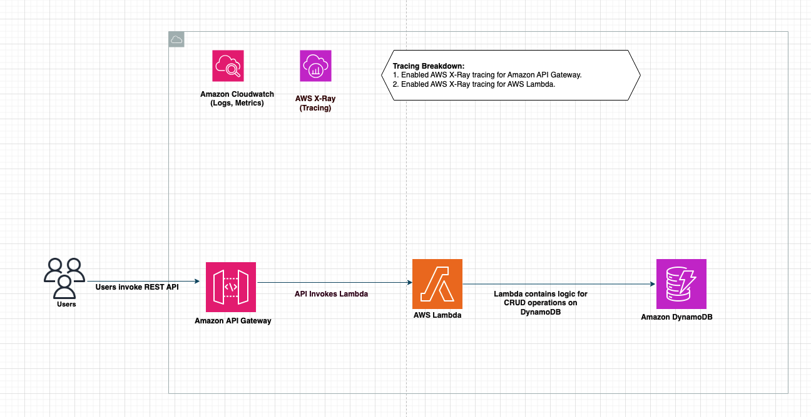

An Amazon API Gateway is a collection of resources and methods. For this tutorial, you create one resource (DynamoDBManager) and define one method (POST) on it. The method is backed by a Lambda function (LambdaFunctionOverHttps). That is, when you call the API through an HTTPS endpoint, Amazon API Gateway invokes the Lambda function.

The POST method on the DynamoDBManager resource supports the following DynamoDB operations:

* Create, update, and delete an item.
* Read an item.
* Scan an item.
* Other operations (echo, ping), not related to DynamoDB, that you can use for testing.

The request payload you send in the POST request identifies the DynamoDB operation and provides necessary data. For example:

The following is a sample request payload for a DynamoDB create item operation:

```json
{
    "operation": "create",
    "tableName": "lambda-apigateway",
    "payload": {
        "Item": {
            "id": "1",
            "name": "Bob"
        }
    }
}
```
The following is a sample request payload for a DynamoDB read item operation:
```json
{
    "operation": "read",
    "tableName": "lambda-apigateway",
    "payload": {
        "Key": {
            "id": "1"
        }
    }
}
```

## Setup

### Create Lambda IAM Role 
Create the execution role that gives your function permission to access AWS resources.

To create an execution role

1. Open the roles page in the IAM console.
2. Choose Create role.
3. Create a role with the following properties.
    * Trusted entity – Lambda.
    * Role name – **lambda-apigateway-role**.
    * Permissions – Custom policy with permission to DynamoDB and CloudWatch Logs. This custom policy has the permissions that  the function needs to write data to DynamoDB and upload logs. 
    ```json
    {
    "Version": "2012-10-17",
    "Statement": [
    {
      "Sid": "Stmt1428341300017",
      "Action": [
        "dynamodb:DeleteItem",
        "dynamodb:GetItem",
        "dynamodb:PutItem",
        "dynamodb:Query",
        "dynamodb:Scan",
        "dynamodb:UpdateItem"
      ],
      "Effect": "Allow",
      "Resource": "*"
    },
    {
      "Sid": "",
      "Resource": "*",
      "Action": [
        "logs:CreateLogGroup",
        "logs:CreateLogStream",
        "logs:PutLogEvents"
      ],
      "Effect": "Allow"
    }
    ]
    }
    ```

### Create Lambda Function

**To create the function**
1. Click "Create function" in AWS Lambda Console

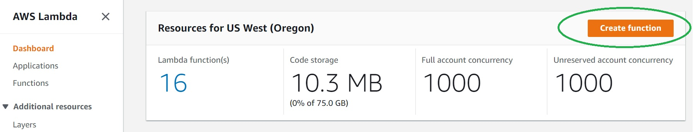

2. Select "Author from scratch". Use name **LambdaFunctionOverHttps** , select **Python 3.7** as Runtime. Under Permissions, select "Use an existing role", and select **lambda-apigateway-role** that we created, from the drop down

3. Click "Create function"

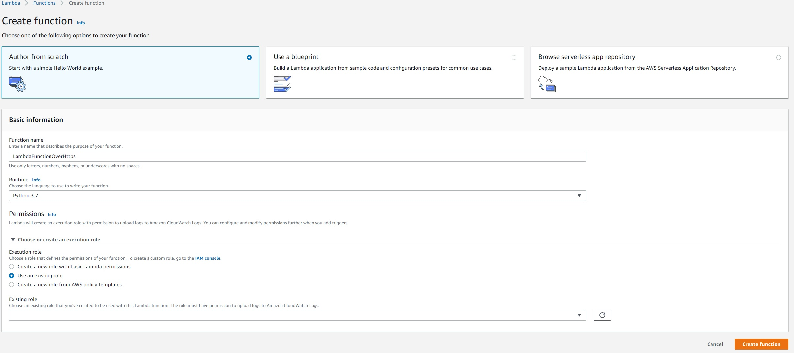

4. Replace the boilerplate coding with the following code snippet and click "Save"

**Example Python Code**
```python
from __future__ import print_function

import boto3
import json

print('Loading function')


def lambda_handler(event, context):
    '''Provide an event that contains the following keys:

      - operation: one of the operations in the operations dict below
      - tableName: required for operations that interact with DynamoDB
      - payload: a parameter to pass to the operation being performed
    '''
    #print("Received event: " + json.dumps(event, indent=2))

    operation = event['operation']

    if 'tableName' in event:
        dynamo = boto3.resource('dynamodb').Table(event['tableName'])

    operations = {
        'create': lambda x: dynamo.put_item(**x),
        'read': lambda x: dynamo.get_item(**x),
        'update': lambda x: dynamo.update_item(**x),
        'delete': lambda x: dynamo.delete_item(**x),
        'list': lambda x: dynamo.scan(**x),
        'echo': lambda x: x,
        'ping': lambda x: 'pong'
    }

    if operation in operations:
        return operations[operation](event.get('payload'))
    else:
        raise ValueError('Unrecognized operation "{}"'.format(operation))
```
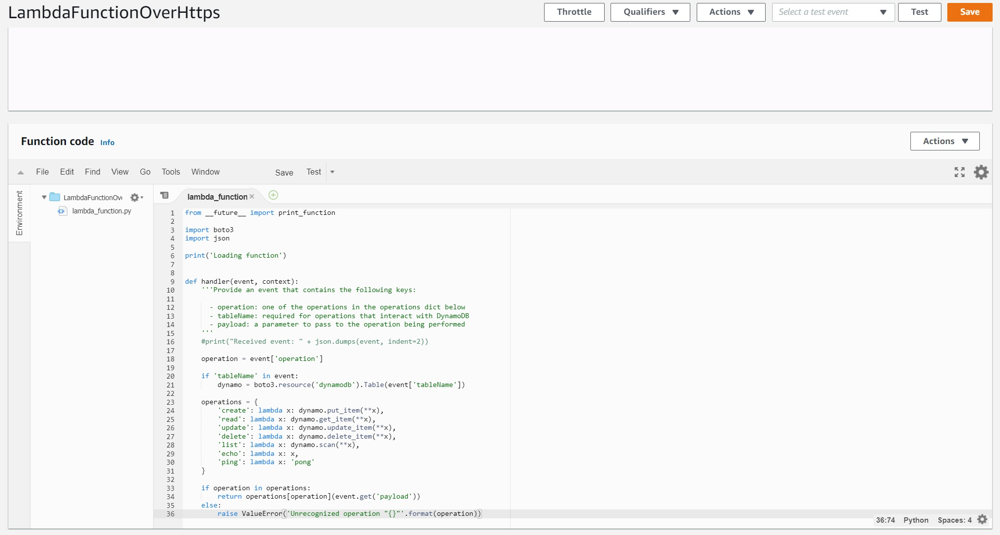

### Test Lambda Function

Let's test our newly created function. We haven't created DynamoDB and the API yet, so we'll do a sample echo operation. The function should output whatever input we pass.
1. Click the arrow on "Select a test event" and click "Configure test events"

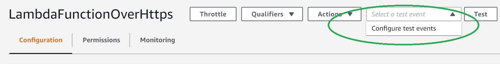

2. Paste the following JSON into the event. The field "operation" dictates what the lambda function will perform. In this case, it'd simply return the payload from input event as output. Click "Create" to save
```json
{
    "operation": "echo",
    "payload": {
        "somekey1": "somevalue1",
        "somekey2": "somevalue2"
    }
}
```
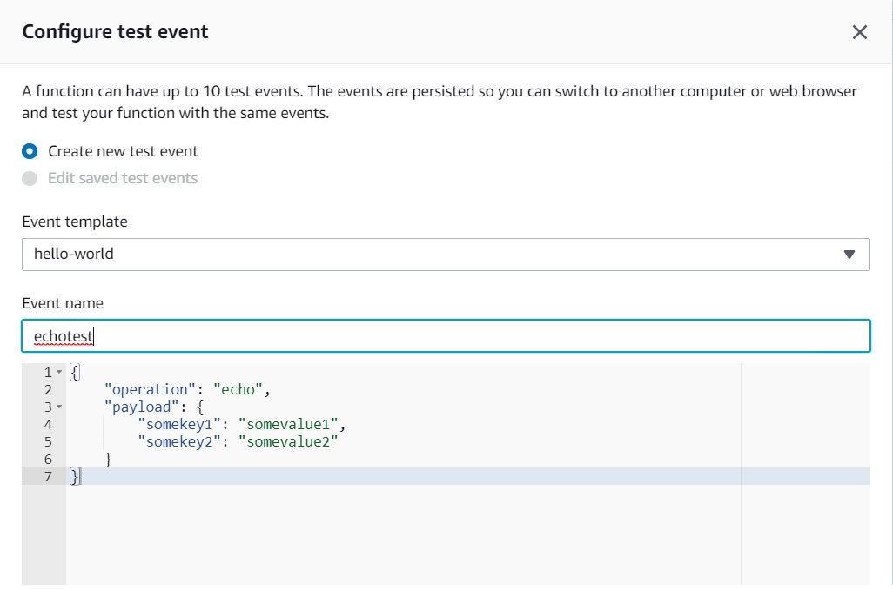

3. Click "Test", and it will execute the test event. You should see the output in the console

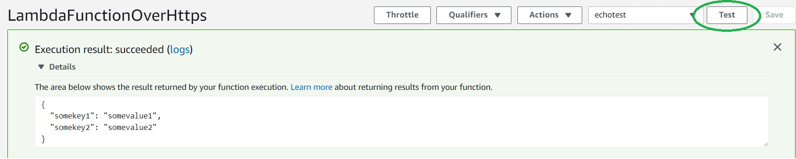

We're all set to create DynamoDB table and an API using our lambda as backend!

### Create DynamoDB Table

Create the DynamoDB table that the Lambda function uses.

**To create a DynamoDB table**

1. Open the DynamoDB console.
2. Choose Create table.
3. Create a table with the following settings.
   * Table name – lambda-apigateway
   * Primary key – id (string)
4. Choose Create.

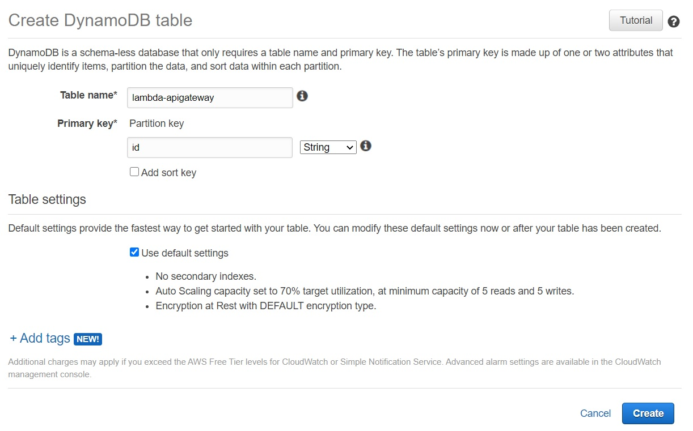


### Create API

**To create the API**
1. Go to API Gateway console
2. Click Create API

 

3. Scroll down and select "Build" for REST API

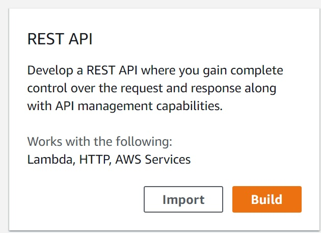 

4. Give the API name as "DynamoDBOperations", keep everything as is, click "Create API"

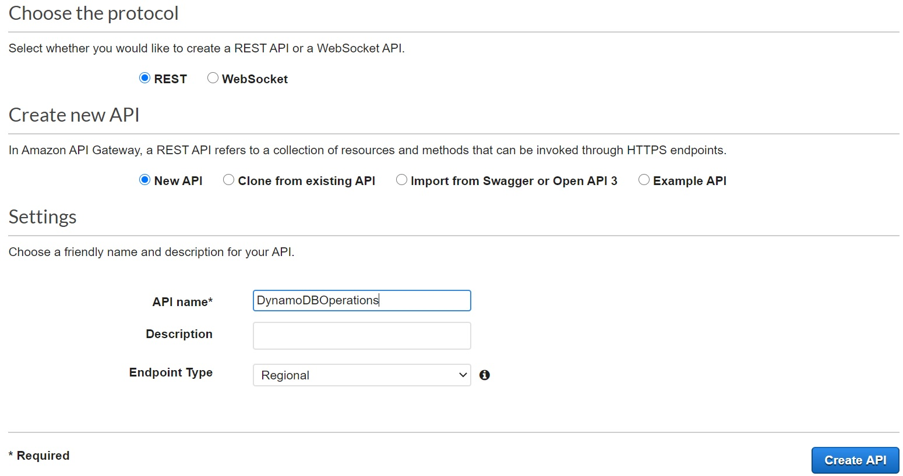

5. Each API is collection of resources and methods that are integrated with backend HTTP endpoints, Lambda functions, or other AWS services. Typically, API resources are organized in a resource tree according to the application logic. At this time you only have the root resource, but let's add a resource next 

Click "Actions", then click "Create Resource"

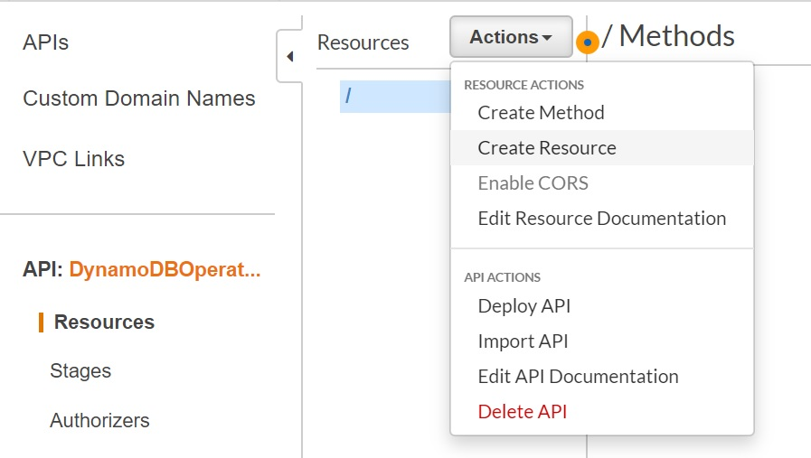

6. Input "DynamoDBManager" in the Resource Name, Resource Path will get populated. Click "Create Resource"

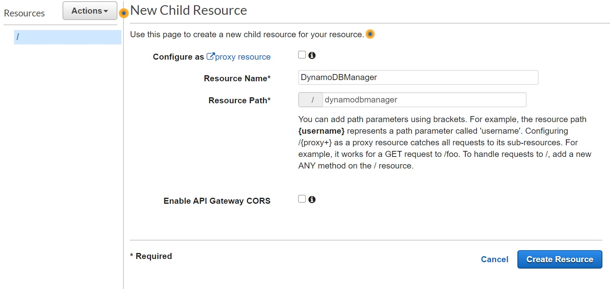

7. Let's create a POST Method for our API. With the "/dynamodbmanager" resource selected, Click "Actions" again and click "Create Method". 

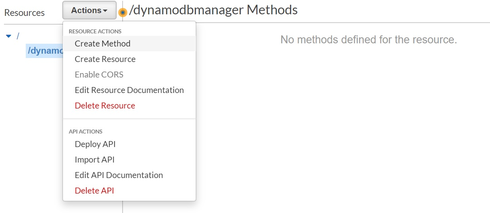

8. Select "POST" from drop down , then click checkmark

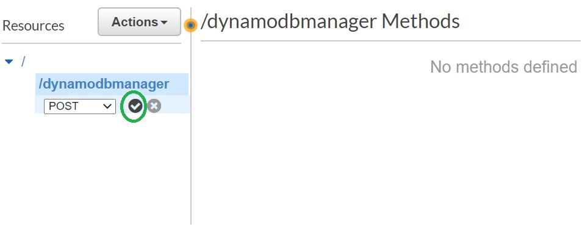

9. The integration will come up automatically with "Lambda Function" option selected. Select "LambdaFunctionOverHttps" function that we created earlier. As you start typing the name, your function name will show up.Select and click "Save". A popup window will come up to add resource policy to the lambda to be invoked by this API. Click "Ok"

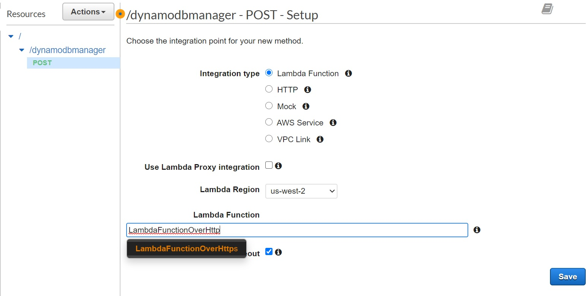

Our API-Lambda integration is done!

### Deploy the API

In this step, you deploy the API that you created to a stage called prod.

1. Click "Actions", select "Deploy API"

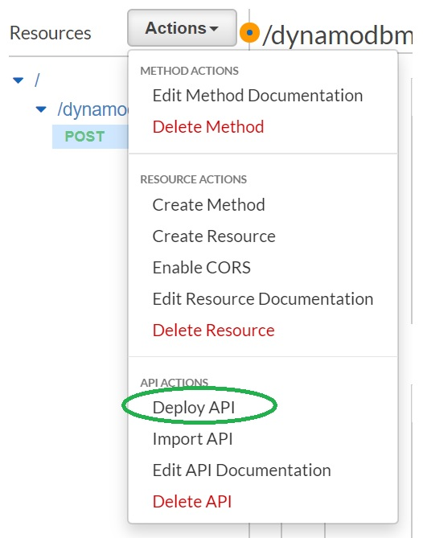

2. Now it is going to ask you about a stage. Select "[New Stage]" for "Deployment stage". Give "Prod" as "Stage name". Click "Deploy"

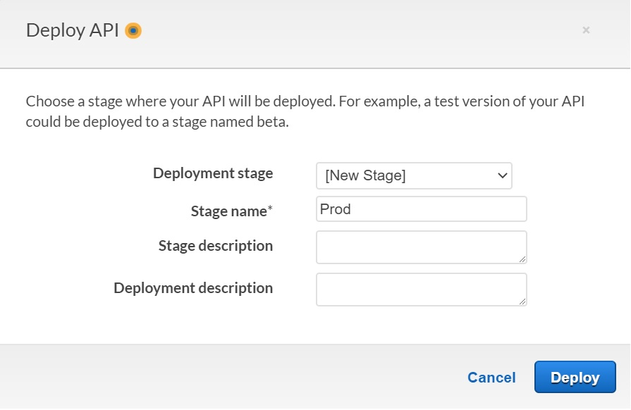

3. We're all set to run our solution! To invoke our API endpoint, we need the endpoint url. In the "Stages" screen, expand the stage "Prod", select "POST" method, and copy the "Invoke URL" from screen

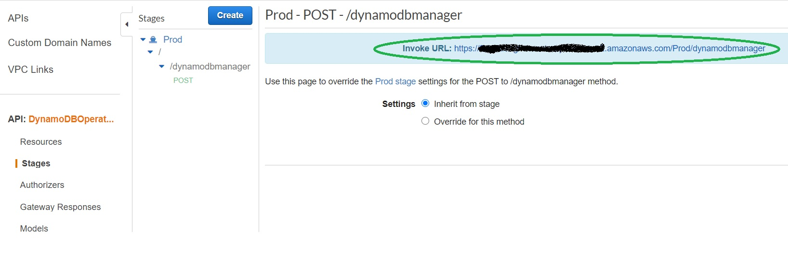


### Running our solution

1. The Lambda function supports using the create operation to create an item in your DynamoDB table. To request this operation, use the following JSON:

```json
{
    "operation": "create",
    "tableName": "lambda-apigateway",
    "payload": {
        "Item": {
            "id": "1234ABCD",
            "number": 5
        }
    }
}
```
2. To execute our API from local machine, we are going to use Postman and Curl command. You can choose either method based on your convenience and familiarity. 
    * To run this from Postman, select "POST" , paste the API invoke url. Then under "Body" select "raw" and paste the above JSON. Click "Send". API should execute and return "HTTPStatusCode" 200.

    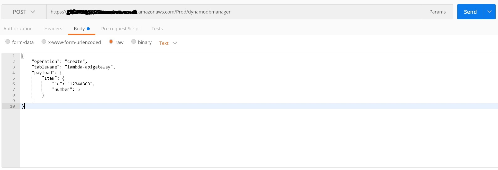

    * To run this from terminal using Curl, run the below
    ```
    $ curl -X POST -d "{\"operation\":\"create\",\"tableName\":\"lambda-apigateway\",\"payload\":{\"Item\":{\"id\":\"1\",\"name\":\"Bob\"}}}" https://$API.execute-api.$REGION.amazonaws.com/prod/DynamoDBManager
    ```   
3. To validate that the item is indeed inserted into DynamoDB table, go to Dynamo console, select "lambda-apigateway" table, select "Items" tab, and the newly inserted item should be displayed.

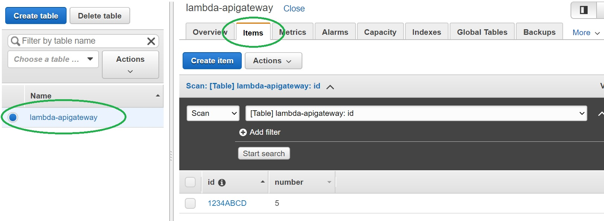

4. To get all the inserted items from the table, we can use the "list" operation of Lambda using the same API. Pass the following JSON to the API, and it will return all the items from the Dynamo table

```json
{
    "operation": "list",
    "tableName": "lambda-apigateway",
    "payload": {
    }
}
```
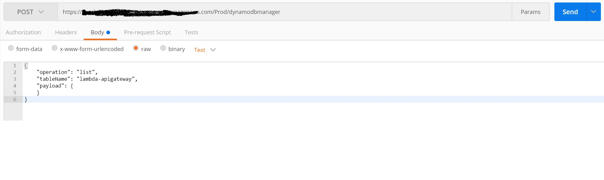

We have successfully created a serverless API using API Gateway, Lambda, and DynamoDB!


API performance testing plays a crucial role in ensuring the reliability and scalability of your APIs. By conducting performance tests, you can achieve the following objectives:

1. Validate that your API can handle the expected load and analyze its response under various load conditions.
2. Optimize and enhance the performance of your API to deliver a seamless user experience.
3. Identify any bottlenecks, latency issues, or failures to ensure the scalability of your system.

## Performing API Performance and Load Testing using Postman

Follow these steps to conduct API performance testing using Postman:

Create a new collection named "Serverless API Performance Testing" in the Postman desktop app.
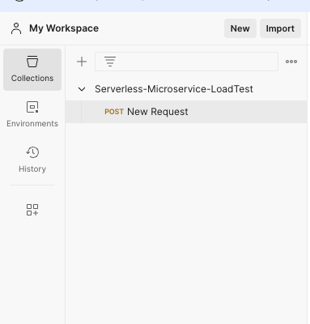
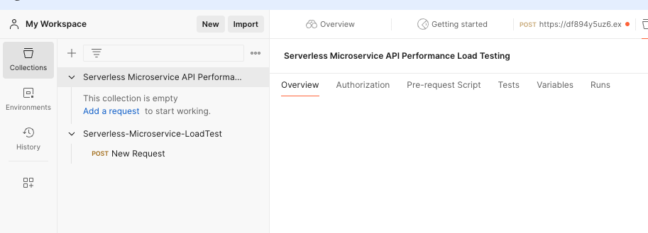
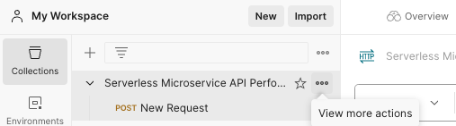
Add a new request to the collection, selecting the "POST" method and providing the API invoke URL.
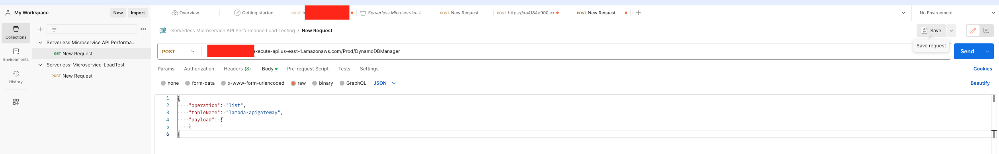
In the request body, input the desired JSON payload to simulate the API operation.
Capture the current configuration of your Lambda function by accessing the AWS Lambda Console.
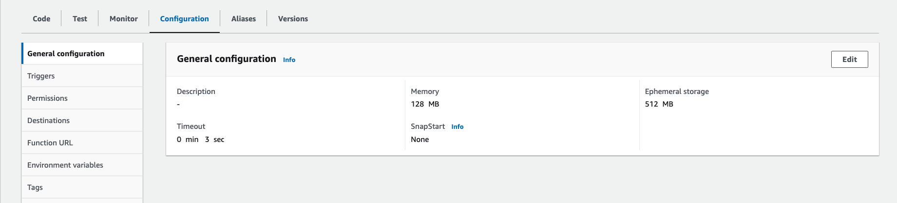
Run the collection in Postman, specifying the desired number of virtual users, test duration, and load profile.
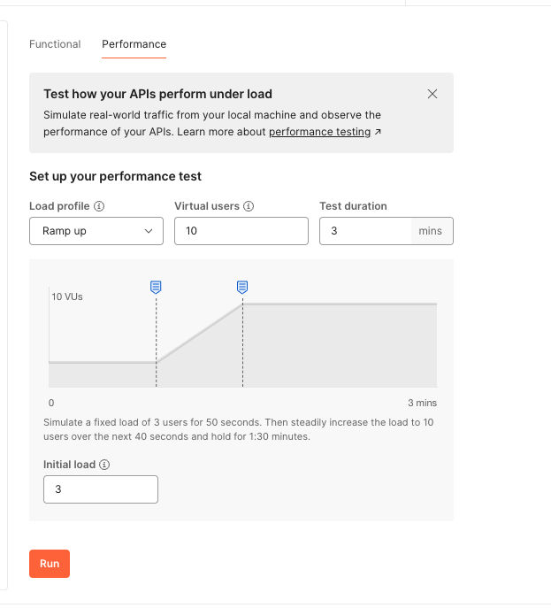
Monitor the performance metrics such as average response time, throughput, and error rate in real-time during the test execution.
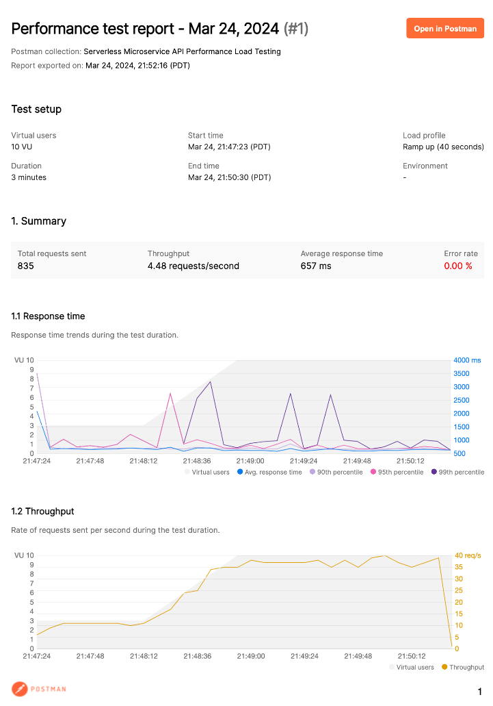

## Improving API Performance

To enhance the performance of your API, consider the following steps:

Increase the memory allocation for your Lambda function through the AWS Lambda Console.
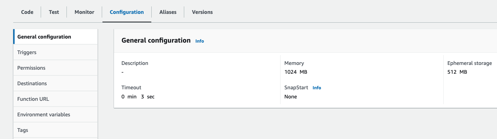
Rerun the performance test in Postman to observe any improvements in performance metrics.
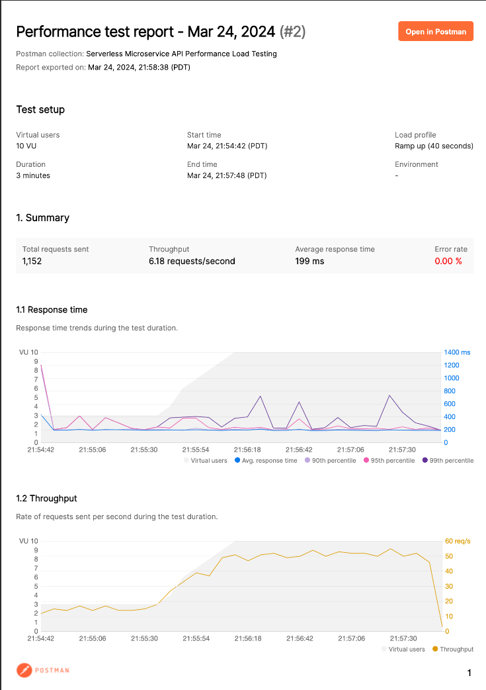
By iteratively optimizing and testing your API performance, you can ensure its reliability and scalability to meet the demands of your users effectively.

# How AWS X-Ray tracing works after enabling it for Amazon API Gateway and AWS Lambda:

## Amazon API Gateway:

When AWS X-Ray tracing is enabled for Amazon API Gateway, it captures incoming requests and traces their journey through the API Gateway.
X-Ray creates segments for each API request, providing detailed information about the request processing, including latency, errors, and downstream calls.
You can visualize the request flow, identify performance bottlenecks, and troubleshoot issues using the X-Ray console or API.

## AWS Lambda:

Enabling AWS X-Ray tracing for AWS Lambda allows you to trace the execution of Lambda functions invoked by API Gateway or other AWS services.
X-Ray automatically instruments your Lambda function code to record detailed information about function invocations, including execution time, errors, and external service calls.
X-Ray captures the trace data and creates a service map, showing the relationship between Lambda functions and other components in your application.
With X-Ray, you can analyze the performance of your Lambda functions, identify inefficiencies, and optimize their execution to improve overall application performance.
Overall, AWS X-Ray tracing provides end-to-end visibility into the interactions between API Gateway, Lambda functions, and other AWS services, helping you understand the performance and behavior of your serverless applications.

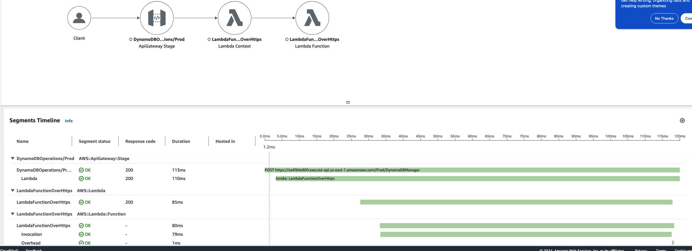
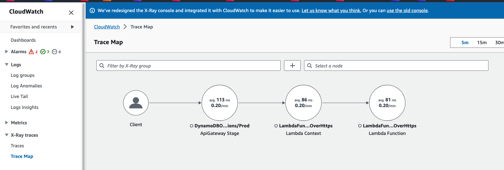


# Secure Your AWS API Gateway Using Cognito - [Work-in-progress] 
## 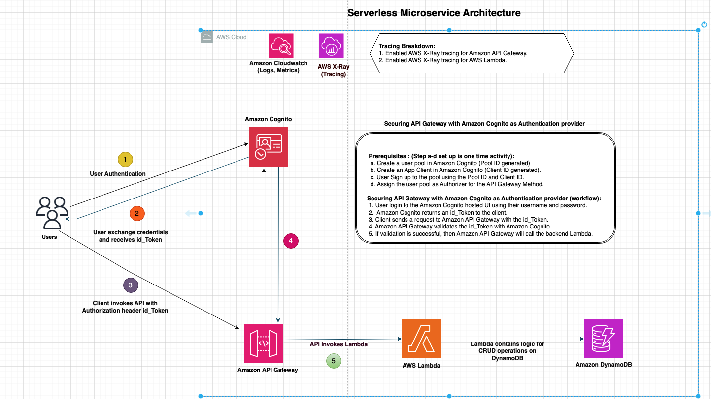

By default, your API Gateway endpoints lack security, leaving them accessible to anyone with the endpoint URL. To manage user access and handle sign-up/sign-in flows, consider leveraging Amazon Cognito.
Utilize an Amazon Cognito user pool to regulate access to your API within Amazon API Gateway.

Note - There are a lot of steps, so please bear with me. :)
Note - AWS console UI has changed a lot so below steps are just for reference only. 

## Step1 - Create a user pool in Amazon Cognito
1. Navigate to Amazon Cognito and click on "Manage User Pools."
2. Click on the "Create a User Pool" button and name your user pool "serverlesspool."
3. Choose "Step through settings" and disable case sensitivity for usernames. Leave other settings as default and proceed.
4. For password strength, set the minimum length to 6 characters and uncheck all options.
5. Allow only admins to create users.
6. Set the temporary password expiration to 7 days and proceed.
7. Choose "No verification" for attribute verification.
8. Provide a role for Amazon Cognito to send SMS messages, and click on "Create Role."
9. Proceed with the default settings until you reach the review stage.
10. Choose "No" for remembering user devices.
11. Create the app client separately (see instructions below).
12. Proceed to the next steps and click on "Create Pool."
13. After creating the user pool, copy the generated pool ID and save it for later use.

## Step2 - Create a App Client in Amazon Cognito
1. Click on "Add an app client" and name your app client "serverless_app_client." Uncheck "Generate client secret" and click on the "Create app client" button.
2. After creating the app client, copy the generated app client ID and save it for later use.

## Step3 - App Integration in Amazon Cognito
1. Navigate to "App integration," then select "Domain name." Under "Amazon Cognito Domain," input "https://api-test-tryout," check its availability, and save the changes. (This domain hosts your sign-in UI, which Amazon provides for you.)
2. After creating hosted domain - It generated hosted domain URL. (Please copy and paste this ID into a notepad for later use.)

## Step4 - App Client Setting in Amazon Cognito
1. Click on "App integration," then navigate to "App client settings." Check the box for "Cognito user pool" to enable the identity provider.
2. Set the "Sign in" and "Sign out" URLs. For the callback URL, use "https://example.com" or "https://google.com." Use the same URL for both sign-in and sign-out.
3. Here's how it works: The Cognito hosted UI prompts users to sign in with their username and password. Once logged in successfully, users are directed to the specified URL ("https://example.com" or "https://google.com").
4. Under "OAuth 2.0," select the OAuth flow and scope enabled for this app. For "Allowed OAuth flows," enable "Authorization code grant" and "Implicit grant." For "Allowed OAuth scopes," enable all options (phone, email, opened, Cognito sign-in, profile). Click on "Save changes" to apply the settings.

## Step5 - Sign up users to user pool in Amazon Cognito
1. Navigate to General settings and select "Users and groups."
2. Click on the "Create user" button, then enter the username as "testuser" and set the password.
3. Disable all additional options, then click on the "Create user" button to confirm. You have now successfully created one user named "testuser."

 
## Step6 - Assign user pool as Authorizer for API Gateway method
1. Navigate to API Gateway and select your API. Click on "Authorizers," then hit the "Create new authorizer" button. Provide a name such as "serverless-authorizer," choose "Cognito" as the type, set the target source to "Authorization," which retrieves the id_token. Finally, click "Create."
2. Within API Gateway, select your API, navigate to "Resources," and choose the desired method (e.g., POST). Click on "Method request," and under settings, change the Authorization setting from "None" to "Cognito user pool" (selecting the previously created "serverless-authorizer").


## Step7 - User exchange Credentials and receive token from Cognito.
1. Cognito hosted UI follow a particular URL format - 
https://<your_hostedomainurl_fromstep3>/login?response_type&client_id=<your_client_id_fromstep2>&redirect_uri=<your_callback_url_fromstep4>
2. Open a browser and paste the above URL into the address bar.
3. The Cognito hosted UI will prompt you to enter your username and password. Proceed by clicking "Sign In."
4. Since the user was created by an admin, you'll be asked to enter a new password. You can enter any email since we're not verifying it (refer to steps 1-11). Click on "Send."
5. You will now be directed to example.com (your callback URL).
6. Observe the URL in the browser and copy it to a notepad. You should see three fields: id_token, token_type, and access_token. You only need the id_token.

## Step 8 - Test it
1. Go to API Gateway and click on the Authorizer (serverless-authorizer).
2. In the textbox for Authorization token (header), paste your id_token value (as obtained in the last step of Step 7).
3. Click on "Test" and verify that the response code is 200. Additionally, observe the fields related to the user in the response.

## Step 9 - Deploy your API and test in Postman tool
1. In Postman, select the POST method and paste the API Gateway invoke URL.
2. Click on the "Headers" tab. Set the key as "Authorization" and the value as your id_token. Click on "Send."
3. Verify the response body.

## Cleanup

Let's clean up the resources we have created for this lab.

### Cleaning up DynamoDB

To delete the table, from DynamoDB console, select the table "lambda-apigateway", and click "Delete table"

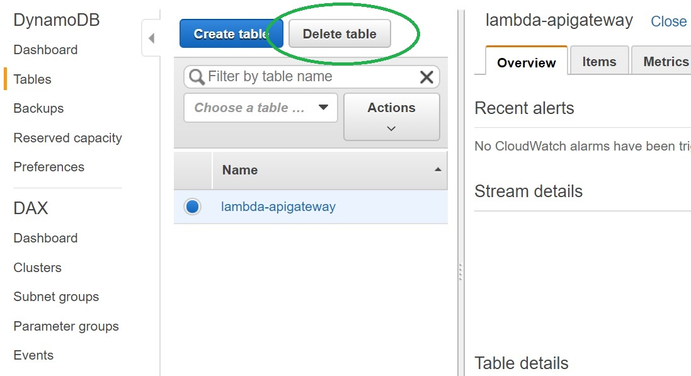

To delete the Lambda, from the Lambda console, select lambda "LambdaFunctionOverHttps", click "Actions", then click Delete 

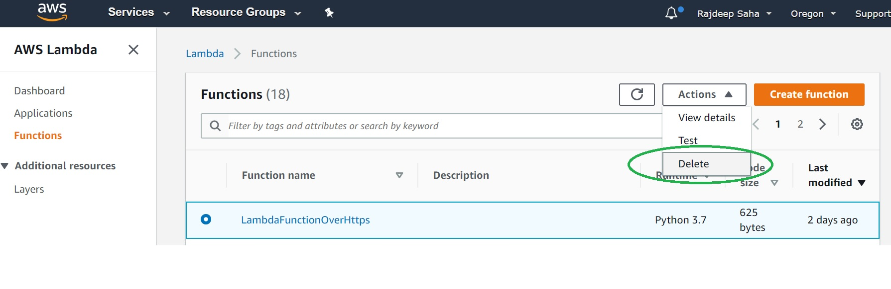

To delete the API we created, in API gateway console, under APIs, select "DynamoDBOperations" API, click "Actions", then "Delete"

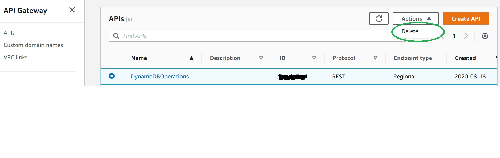

